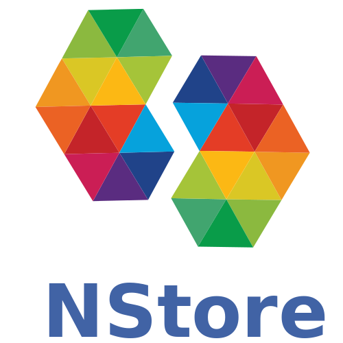

# NStore
**(Yet Another) Opinionated Event Sourcing Library**

This project is a playground for experimenting with .net Standard, async and a simple API for a Sql/NoSql backed EventStore.
Heavily inspired from NEventStore, rewritten from scratch to be simple to learn and highly extensible.

## CI Status

| Build server | Platform | Build Status |
| ------------ | -------- | ------------ |
| AppVeyor     | Windows  |  |
| Travis       | Ubuntu   |  |

## Quickstart

### Streams API

    var persister = new InMemoryPersistence();
    var streams = new StreamsFactory(persister);

    // Write to stream
    var stream = streams.Open("Stream_1");
    await stream.AppendAsync(new { data = "Hello world!" });

    // Read from stream
    await stream.ReadAsync(data => {
        Console.WriteLine($"  index {data.Index} => {data.Payload}");
        return Task.FromResult(true);
    });

---
## Learn
The source comes with a [Sample App](https://github.com/ProximoSrl/NStore/tree/develop/src/NStore.Sample) to illustrate some basic stuff you can do.

## Follow this project
[Roadmap](https://github.com/ProximoSrl/NStore/milestones?direction=asc&sort=due_date&state=open)
